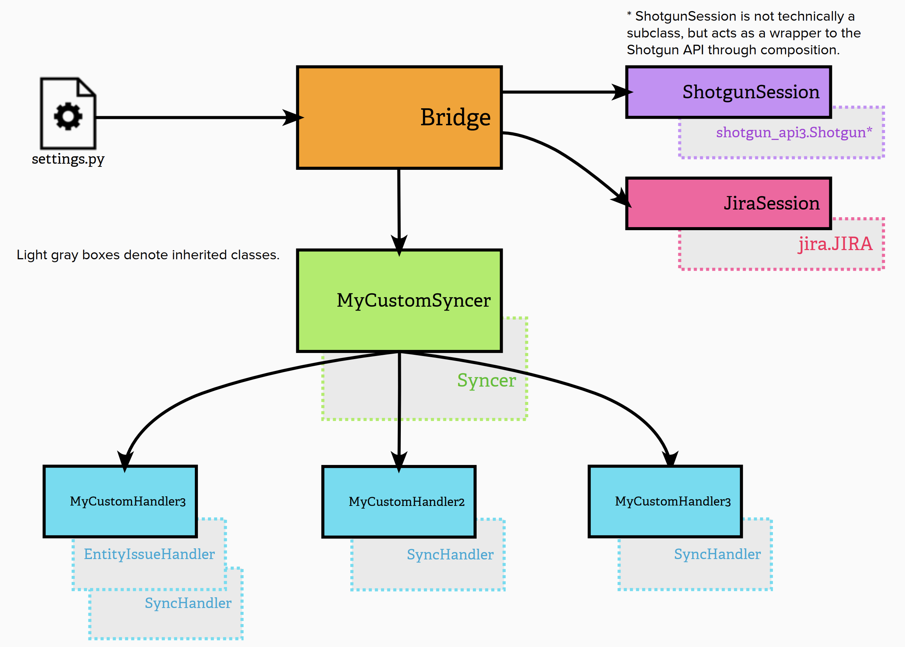

Developer Resources
###################

.. currentmodule:: sg_jira

Customizing the Workflow
************************
SG Jira Bridge is structured so that studios can tailor the workflow to
meet their specific needs. Because both ShotGrid and Jira are highly
customizable, exposing a handful of settings would not be sufficient.
Therefore, the bridge has been structured to allow subclassing the
various components that control syncing and handling events in order
to give full control over the logic of what is being done.

Structure Overview
==================

Bridge
======
The :class:`Bridge` is the main class for the sync. It handles the
connections to both ShotGrid and Jira, manages sync settings
from the ``settings.py`` file, and initiates the calls to sync
in ShotGrid and Jira.

This class is intended to be used as-is without requiring customization
since the details of the workflow logic are defined in the :class:`Syncer`
and :class:`~handlers.SyncHandler`. When creating a new instance
of :class:`Bridge`, typically you'll use the :meth:`Bridge.get_bridge`
factory method and pass in the full path to the settings file.

Syncers
=======
The :class:`Syncer` is in charge of initially determining whether to accept or
reject events from ShotGrid and Jira for syncing. This is done with the
:meth:`~Syncer.accept_shotgun_event` and :meth:`~Syncer.accept_jira_event`
methods. It performs initial basic checks on
the event to determine if it should immediately be rejected without needing
to ask the handlers. These checks should be completely independent of the
implementation details of the handlers. For example, a ShotGrid event can
be inspected to ensure it has the basic required fields in an event like the
``meta`` and ``project`` keys. Without either of these keys in the event,
no handlers could process the event anyway.

If nothing in the event immediately disqualifies itself from consideration,
the :class:`Syncer` then hands the event off to each
:class:`~handlers.SyncHandler` to accept the event or not. The first handler
that accepts the event is then returned to process the event.

.. note::
    Only one handler may process an event since having multiple handlers process
    a single event could cause issues where one handler undoes what a previous
    one did for the same event.

Syncers must be sub-classed from the base :class:`Syncer` class in order to
implement a list of Handlers to dispatch events to. The ``handlers()`` property
must be overridden but additional parameters can be accepted by the class as
well, to pass on to Handlers::

    from .syncer import Syncer
    from .handlers import TaskIssueHandler, NoteCommentHandler, EnableSyncingHandler

    class TaskIssueSyncer(Syncer):
        """
        Sync ShotGrid Tasks as Jira Issues.
        """
        def __init__(self, issue_type="Task", **kwargs):
            """
            Instatiate a new Task/Issue syncer for the given bridge.

            :param str issue_type: Jira Issue type to use when creating new Issues.
            """
            self._issue_type = issue_type
            super(TaskIssueSyncer, self).__init__(**kwargs)
            self._task_issue_handler = TaskIssueHandler(self, self._issue_type)
            self._note_comment_handler = NoteCommentHandler(self)
            # A handler combining the Task <-> Issue handler and the Note <-> Comment
            # handler. Task syncing to Jira starts if the Task "Sync in Jira" checkbox
            # is turned on. Notes linked to a Task being actively synced are automatically
            # synced without having to manually select them. A full sync is performed
            # when the Task checkbox is turned on.
            self._enable_syncing_handler = EnableSyncingHandler(
                self,
                [self._task_issue_handler, self._note_comment_handler]
            )

        @property
        def handlers(self):
            """
            Return a list of :class:`~handlers.SyncHandler` instances.
            """
            return [
                self._enable_syncing_handler,
                self._task_issue_handler,
                self._note_comment_handler
            ]

Sync Handlers
=============
A :class:`~handlers.SyncHandler` holds the logic for syncing values between a
ShotGrid Entity type and a Jira resource and is owned by a :class:`Syncer`
instance. The base class defines the interface all handlers should support
and provides a set of helper methods useful for implementations.

The following methods must be overridden from the :class:`Syncer` base class::

    # public methods
    accept_shotgun_event()
    accept_jira_event()
    process_shotgun_event()
    process_jira_event()

    # private property
    _sg_jira_status_mapping()

Setup
-----
When a syncer is first loaded, it calls ``setup()`` on each
:class:`~handlers.SyncHandler`. This can be used to check the Jira and ShotGrid
sites for specific conditions or setup requirements, ensuring that the sync can
safely happen.

Additionally, this can be used to cache value(s) from either site if there are
queries that might be done repeatedly that slow things down during the sync
process.

Accepting the Event
-------------------
After the :class:`Syncer` has done its initial checks to decide whether to
accept an event, it then passes the event off to its handlers to check for
themselves. Each :class:`~handlers.SyncHandler` must define a
:meth:`~handlers.SyncHandler.accept_shotgun_event` and
:meth:`~handlers.SyncHandler.accept_jira_event` which overrides the
:class:`Syncer` base class. This is where the more specific logic for accepting
or rejecting an event can occur. Checks for things like whether the event is
for a ShotGrid Entity type or Jira resource type that the handler cares about
are appropriate. Or for example, you may wish to check a ShotGrid event to see
if the Task field that was changed, is one that is supported by your handler.

The goal of these methods is to quickly determine whether to process the event
*given the information provided*. **Queries are expensive**. If after checking
all of the given event info, there are still more questions to answer that
require making additional queries to ShotGrid or Jira, it is perfectly
fine for these to be done in the
:meth:`~handlers.SyncHandler.process_shotgun_event` or
:meth:`~handlers.SyncHandler.process_jira_event` methods later.

Processing the Event
--------------------
:meth:`~handlers.SyncHandler.process_shotgun_event` and
:meth:`~handlers.SyncHandler.process_jira_event` process the event data,
perform any additional validation required to determine whether to continue
with the sync (which may include additional queries to Jira and/or ShotGrid),
and then do the actual update.

Once the event itself has been validated fully, the actual data that has
changed is validated and converted to a format appropriate for the recipient
of the sync. There are private methods in the base classes that perform some
of the heavy lifting for this.

If the event was processed successfully, it returns ``True``. If the event was
not processed for any reason it returns ``False``.

EntityIssueHandler
------------------
In addition to the base :class:`~handlers.SyncHandler`, there is also a
:class:`~handlers.EntityIssueHandler` which serves as a base class for handlers
that sync between a ShotGrid Entity type and a Jira Issue resource. Since this
is probably how a majority of workflows will work, it is provided to add an
additional level of convenience.

It inherits from :class:`~handlers.SyncHandler`. When using
:class:`~handlers.EntityIssueHander` as a base class, the following methods
must be overridden *in addition to the ones required by*
:class:`~handlers.SyncHandler`::

    _get_jira_issue_field_for_shotgun_field()
    _supported_shotgun_fields_for_jira_event()
    _get_shotgun_entity_field_for_issue_field()

API
***

Connections to ShotGrid and Jira
===============================
These classes manage the specific connections to ShotGrid and Jira.

ShotgunSession
--------------
.. autoclass:: sg_jira.shotgun_session.ShotgunSession
    :members:
    :inherited-members:

JiraSession
-----------
.. autoclass:: sg_jira.jira_session.JiraSession
    :members:
    :special-members: __init__

Bridge
======
This is the main class that holds handles to both ShotGrid and Jira
and handles dispatching events to both sites.

.. autoclass:: Bridge
    :members:
    :inherited-members:
    :special-members: __init__

Syncers
=======
Base class in charge of initially determining whether to accept events
from ShotGrid and Jira for syncing. If accepted, it then passes on
the event to a Handler to process the event.

This must be subclassed to implement a list of Handlers to dispatch
events to. Additional parameters can be accepted as well to pass on
to Handlers.

.. literalinclude:: ../sg_jira/task_issue_syncer.py
    :language: python
    :lines: 8-

Syncer
------
.. autoclass:: Syncer
    :members:
    :inherited-members:
    :special-members: __init__

SyncHandlers
============
.. currentmodule:: sg_jira.handlers

Base class that handles a particular sync instance between ShotGrid and Jira.

Handlers hold the main logic for syncing values between a ShotGrid Entity type
and a Jira resource. They are owned by a :class:`~sg_jira.Syncer` instance.
This base class defines the interface all handlers should support and
provides helpers methods useful to all implementations.

SyncHandler
-----------
.. autoclass:: SyncHandler
    :members:
    :inherited-members:
    :special-members: __init__

EntityIssueHandler
------------------
Base class for syncing ShotGrid Entities and Jira Issues. This inherits from
:class:`SyncHandler`.

.. autoclass:: EntityIssueHandler
    :show-inheritance:
    :members:
    :inherited-members:
    :special-members: __init__

EnableSyncingHandler
--------------------
A handler that controls the initial sync for a ShotGrid Task and Jira Issue when
the "Sync In Jira" checkbox is toggled in ShotGrid. It combines multiple
handlers to begin the syncing process by performing a full sync each time the
checkbox is toggled on. This allows one to manually force a re-sync if needed
by just toggling the checkbox off and then on again.

Inherits from :class:`SyncHandler`.

.. autoclass:: EnableSyncingHandler
    :members:
    :inherited-members:
    :special-members: __init__

Utils
=====
.. currentmodule:: sg_jira

Common utility functions.

.. automodule:: sg_jira.utils
    :members:

Errors
======
.. automodule:: sg_jira.errors
    :members:
    :inherited-members:

Tests & CI
**********
Unit tests are in the ``/tests`` folder. A ``requirements.txt`` file is
available in this folder as well to install the required modules to run the
tests.

Run the tests from the tests directory with ``python run_tests.py``.

Continuous Integration (CI)
===========================
`Azure Pipelines <https://github.com/marketplace/azure-pipelines>`_ are used
for the continuous integration and run the following validations:

- Enforce reasonable PEP-8 conventions with Flake8.
- Run unit tests on Linux, Mac and Windows with Python 2.7.

Azure Pipelines jobs are defined by the description files in the
``/azure-pipelines`` folder.
