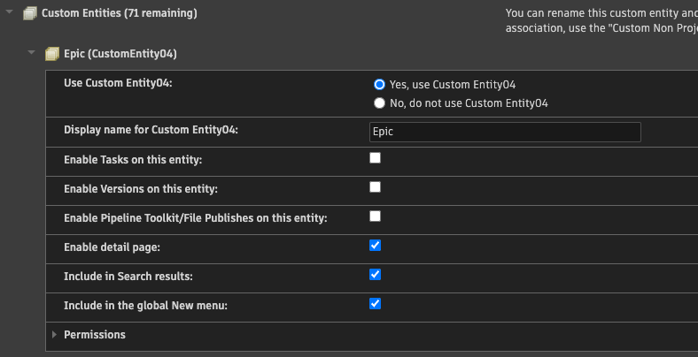
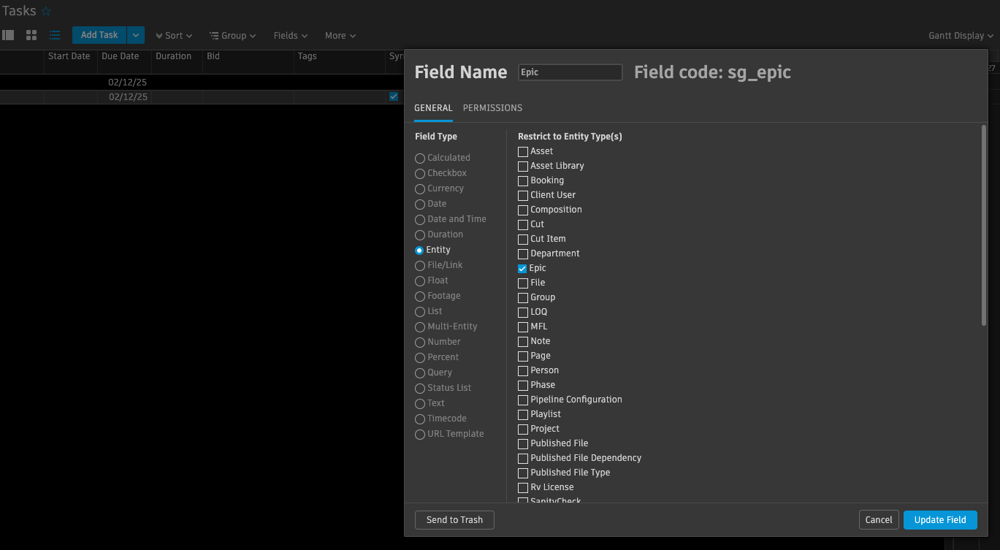
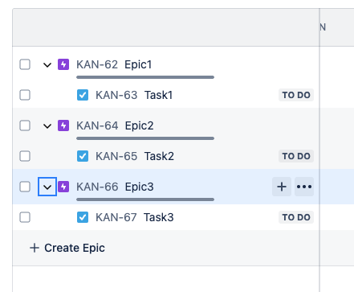
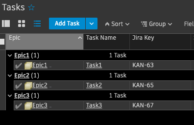

Generic Syncer
##############

Description
***********

In order to make the Jira Bridge customization easier, we're introducing a new syncer/handler.
It offers the following changes:

* Uses the ``settings.py`` file to define the entities and fields we want to synchronize
* Adds support for initiating the sync from Jira, not only from Flow Production Tracking
* Introduces a new hook functionality to override the behavior of some methods

Configuration
*************

At this point, we are assuming that the Jira Bridge has been correctly configured by following the main configuration process.
The next section describes only the steps required to set up and configure this new handler.

.. _entity-sync-jira-config:

Jira Configuration
==================

For each Issue Type we want to sync in Jira, we need to make sure that the following Jira fields exist and are available in Boards:

+--------------+-----------------------------+----------------------------------------------------------------------------------------------------------+
| Field Name   |             Type            | Description                                                                                              |
+==============+=============================+==========================================================================================================+
| Shotgun Type |             Text            | Stores the associated Flow Production Tracking Entity type                                               |
+--------------+-----------------------------+----------------------------------------------------------------------------------------------------------+
| Shotgun ID   |             Text            | Stores the associated Flow Production Tracking Entity ID                                                 |
+--------------+-----------------------------+----------------------------------------------------------------------------------------------------------+
| Shotgun URL  |             Text            | Stores a link to the detail page for the associated entity in PTR                                        |
+--------------+-----------------------------+----------------------------------------------------------------------------------------------------------+
| Sync In FPTR | Select List (single choice) | Boolean to trigger the sync from Jira to FPTR. It should contain two options: ``True`` and ``False``     |
+--------------+-----------------------------+----------------------------------------------------------------------------------------------------------+

.. _entity-sync-fptr-config:

Flow Production Tracking Configuration
======================================

For each entity type we want to sync in Flow Production Tracking as Jira Issues, we need to make sure that the following FPTR fields exist:

============= =========== ======================================= ============================
Field Name    Field Type  Description                             Field Code (auto-generated)
============= =========== ======================================= ============================
Jira Sync URL File/Link   URL of the associated Jira Bridge Issue  ``sg_jira_sync_url``
Jira Key      Text        Synced Issue Key value in Jira           ``sg_jira_key``
Sync In Jira  Checkbox    Enable/Disable syncing for this Entity   ``sg_sync_in_jira``
============= =========== ======================================= ============================

.. note::
    The Flow Production Tracking ``TimeLog`` and ``Note`` entities follow a specific workflow. For those entity types, only the
    ``Jira Key`` field is mandatory.

Flow Production Tracking Event Daemon Configuration
===================================================

As soon as you want to enable the sync from Flow Production Tracking to Jira for a new entity type, you don't need to forgot to update
the ``sg_jira_event_trigger`` plugin and add the corresponding event.

Enabling the syncer
===================

To use this generic syncer, you need to point at the right entry in the settings file.
In order to do that, you have to make sure the right URLs are used in both Flow Production Tracking and Jira.

Looking at the syncer entry in the ``settings.py`` file

.. code-block:: python

    SYNC = {
        # Add the entities generic syncer to the list of syncers, it will be available
        # with the http://<your server>/jira2sg/entities and http://<your server>/sg2jira/entities
        # urls.
        "entities": {
            "syncer": "sg_jira.EntitiesGenericSyncer",
            "settings": {
            },
        }
    }

You need to make sure that:

* ``http://<your server>/sg2jira/entities`` is used in the ``Jira Sync URL`` field of your Flow Production Tracking Project
* ``http://<your server>/jira2sg/entities`` is used in the webhook URL on the Jira side

Configure the Bridge sync settings
==================================

To have an easier way to configure/customize what to sync between Flow Production Tracking and Jira, everything is now done
through the ``settings.py`` file by mapping Flow Production Tracking entity type/fields with Jira Issue type/fields.

.. _entity-sync-settings:

Defining entity syncing
-----------------------

In order to sync a Flow Production Tracking entity type as Issue in Jira, you need to add the following entries to the ``entity_mapping`` dictionary.

==================== ====================================================================================
Key Name             Description
==================== ====================================================================================
``sg_entity``        Type of the Flow Production Entity we want to sync as Jira Issue
``jira_issue_type``  Type of the Jira Issue we want to associate to the Flow Production Tracking Entity
``field_mapping``    List of Python dictionaries defining the entity fields to sync
``status_mapping``   Python dictionary to specify how to sync statuses for the given enty and issue type
``sync_direction``   [Optional] Specify the sync direction (default is both way)
==================== ====================================================================================

To define which fields are going to sync for a specific entity type, we are relying on the ``field_mapping`` list of dictionaries specify in the table above.
Each dictionary of the list must contains the following entries:

==================== ====================================================================================
Key Name             Description
==================== ====================================================================================
``sg_field``         Code of the Flow Production Tracking field we want to sync to Jira
``jira_field``       Name of the associated Jira field we want to sync to the Flow Production Tracking
``sync_direction``   [Optional] Specify the sync direction (default is both way)
==================== ====================================================================================

.. note::
    Only the fields added in the ``field_mapping`` list will be synced between Flow Production Tracking and Jira.

Here is an example to sync Flow Production Task entity as Jira Task Issue, only syncing the FPTR ``content`` field mapped to the Jira ``summary`` field.

.. code-block:: python
    :emphasize-lines: 9,10,11,12,13,14

    SYNC = {
        "entities": {
            "syncer": "sg_jira.EntitiesGenericSyncer",
            "settings": {
                "entity_mapping": [
                    {
                         "sg_entity": "Task",
                         "jira_issue_type": "Task",
                         "field_mapping": [
                            {
                                 "sg_field": "content",
                                 "jira_field": "summary",
                            }
                         ]
                    }
                ]
            },
        }
    }

Specifying sync direction
-------------------------

To have more control over what to sync, it is possible to define a sync direction by entity type and fields.
To do that, you need to use the ``sync_direction`` dictionary key described in the table above.
If you don't specify the ``sync_direction``, the sync will happen both way by default.

The ``sync_direction`` values can be one of the following:

==================== ============================================================================================================
Key value            Description
==================== ============================================================================================================
``both_way``         The entity or field will be synced both way (update from FPTR will be reflected in Jira and vice-versa)
``jira_to_sg``       The entity or field synced will be happening only from Jira to FPTR (update from FPTR won't appear in Jira)
``sg_to_jira``       The entity or field synced will be happening only from FPTR to Jira (update from Jira won't appear in FPTR)
==================== ============================================================================================================

Here is an example of the use of the ``sync_direction`` setting:

.. code-block:: python
    :emphasize-lines: 9

    SYNC = {
        "entities": {
            "syncer": "sg_jira.EntitiesGenericSyncer",
            "settings": {
                "entity_mapping": [
                    {
                         "sg_entity": "Task",
                         "jira_issue_type": "Task",
                         "sync_direction": "both_way",
                         "field_mapping": [
                            {
                                 "sg_field": "content",
                                 "jira_field": "summary",
                                 "sync_direction": "jira_to_sg",
                            }
                         ]
                    }
                ]
            },
        }
    }

Status mapping
--------------

It is also possible to sync statuses between a Jira Issue and a Flow Production Tracking entity.
In order to do that, you will use the ``status_mapping`` entry described in :ref:`entity-sync-settings`.

The ``status_mapping`` entry is a python dictionary that accepts the following entries:

==================== ========================================================================================================
Key Name             Description
==================== ========================================================================================================
``sg_field``         Code of the Flow Production Tracking status field we want to sync with the Jira Issue status
``mapping``          Python dictionary where the key is the FPTR status code and the value is the associated Jira status name
``sync_direction``   [Optional] Specify the sync direction (default is both way)
==================== ========================================================================================================

.. note::
    For statuses, we only need to specify the FPTR field we want to use as a FPTR entity can have many status fields.
    But a Jira Issue can have one and only one status field.

Here is an example of what a ``status_mapping`` definition can look like:

.. code-block:: python
    :emphasize-lines: 15,16,17,18,19,20,21,22,23,24

    SYNC = {
        "entities": {
            "syncer": "sg_jira.EntitiesGenericSyncer",
            "settings": {
                "entity_mapping": [
                    {
                         "sg_entity": "Task",
                         "jira_issue_type": "Task",
                         "field_mapping": [
                            {
                                 "sg_field": "content",
                                 "jira_field": "summary",
                            }
                         ],
                         "status_mapping": {
                            "sync_direction": "jira_to_sg",
                            "sg_field": "sg_status_list",
                            "mapping": {
                                "wtg": "To Do",
                                "rdy": "Open",
                                "ip": "In Progress",

                            }
                        }
                    }
                ]
            },
        }
    }

Parent/children relationship
----------------------------

In Jira, it is possible to define an issue type hierarchy.
Replicating this behavior in Flow Production Tracking can be done using ``entity``/``multi-entity`` field relationship between entities.

In the Jira Bridge settings, the hierarchy is defined using the ``parent`` Jira field associated to the corresponding FPTR field in the ``field_mapping`` entry.

In order to have both-way sync, we also need to define the child relationship. As there is no child field for Jira Issues, the ``{{CHILDREN}}`` keyword must be used instead.

Here is an example of how to replicate the Task/Epic Jira relationship, using a FPTR Custom Entity:

.. code-block:: python
    :emphasize-lines: 14,15,16,17,28,29,30,31

    SYNC = {
        "entities": {
            "syncer": "sg_jira.EntitiesGenericSyncer",
            "settings": {
                "entity_mapping": [
                    {
                         "sg_entity": "Task",
                         "jira_issue_type": "Task",
                         "field_mapping": [
                            {
                                 "sg_field": "content",
                                 "jira_field": "summary",
                            },
                            {
                                 "sg_field": "sg_epic",
                                 "jira_field": "parent",
                            },
                         ],
                    },
                    {
                         "sg_entity": "CustomEntity04",
                         "jira_issue_type": "Epic",
                         "field_mapping": [
                            {
                                 "sg_field": "code",
                                 "jira_field": "summary",
                            },
                            {
                                 "sg_field": "sg_tasks",
                                 "jira_field": "{{CHILDREN}}",
                            },
                         ],
                    }
                ]
            },
        }
    }

.. note::
    As a Jira Issue can only have one parent, the associated FPTR field must be an ``entity`` field (and not a ``multi-entity`` field)

Syncing FPTR Notes as Jira Comments
-----------------------------------

Flow Production Tracking Note entity has a specific behavior: in Jira they will be represented as Comments and always be linked to an existing Issue.
The entity mapping is done automatically, that's why we don't need to define the ``jira_issue_type`` and ``field_mapping`` keys.

To enable Note syncing, you only need to add the entry in the ``entity_mapping`` dictionary with the ``sg_field`` key.

Notes/Comments workflow also handle deletion. In order to control what will be deleted, a new ``sync_deletion_direction`` setting has been introduced and can have the following values:

==================== =================================================================================================================================================================
Key value            Description
==================== =================================================================================================================================================================
``None``             [**DEFAULT VALUE**] If a Note is deleted in FPTR, the associated Comment won't be deleted in Jira (and vice-versa)
``both_way``         If a Note is deleted in FPTR, the associated Comment will be deleted in Jira (and vice-versa)
``jira_to_sg``       If a Note is deleted in FPTR, the associated Comment won't be deleted in Jira. But if a Comment is deleted in Jira, the associated Note will be deleted in FPTR
``sg_to_jira``       If a Note is deleted in FPTR, the associated Comment will be deleted in Jira. But if a Comment is deleted in Jira, the associated Note won't be deleted in FPTR
==================== =================================================================================================================================================================

Here is an example of how you can enable Note/Comment syncing:

.. code-block:: python
    :emphasize-lines: 16,17,18,19

    SYNC = {
        "entities": {
            "syncer": "sg_jira.EntitiesGenericSyncer",
            "settings": {
                "entity_mapping": [
                    {
                         "sg_entity": "Task",
                         "jira_issue_type": "Task",
                         "field_mapping": [
                            {
                                 "sg_field": "content",
                                 "jira_field": "summary",
                            }
                         ]
                    },
                    {
                        "sg_entity": "Note",
                        "sync_deletion_direction": "jira_to_sg",
                    }
                ]
            },
        }
    }

.. note::
    If you want to enable Comment deletion from Jira, you have to make sure that the ``Comment: deleted`` event is enable in the Jira webhook.
    On the Flow Production Tracking side, you don't need to do anything special as the FPTR Event Daemon ``sg_jira_event_trigger`` plugin already handle it.

.. note::
    When creating a Jira comment using the API, it is not possible to set the author. In order to keep a track of who created the Note in FPTR, the
    author name will be embedded in the Jira comment body.

Syncing FPTR TimeLogs as Jira Worklogs
--------------------------------------

Flow Production Tracking TimeLog entity has a specific behavior: in Jira they will be represented as Worklogs and always be linked to an existing Issue.
The entity mapping is done automatically, that's why we don't need to define the ``jira_issue_type``key but you can still use the ``field_mapping`` key to decide which fields to sync.

.. note::
   When creating a Worklog in Jira, some fields are mandatory. So you need to make sure that the ``comment`` and ``timeSpentSeconds`` Jira fields are correctly
    mapped to some FPTR TimeLog fields.

TimeLogs/Worklogs workflow also handle deletion. In order to control what will be deleted, a new ``sync_deletion_direction`` setting has been introduced and can have the following values:

==================== ======================================================================================================================================================================
Key value            Description
==================== ======================================================================================================================================================================
``None``             [**DEFAULT VALUE**] If a TimeLog is deleted in FPTR, the associated Worklog won't be deleted in Jira (and vice-versa)
``both_way``         If a TimeLog is deleted in FPTR, the associated Worklog will be deleted in Jira (and vice-versa)
``jira_to_sg``       If a TimeLog is deleted in FPTR, the associated Worklog won't be deleted in Jira. But if a Worklog is deleted in Jira, the associated TimeLog will be deleted in FPTR
``sg_to_jira``       If a TimeLog is deleted in FPTR, the associated Worklog will be deleted in Jira. But if a Worklog is deleted in Jira, the associated TimeLog won't be deleted in FPTR
==================== ======================================================================================================================================================================

Here is an example of how you can enable TimeLog/Worklog syncing:

.. code-block:: python
    :emphasize-lines: 16,17,18,19,20,21,22,23,24,25,26,27,28,29,30,31,32,33

    SYNC = {
        "entities": {
            "syncer": "sg_jira.EntitiesGenericSyncer",
            "settings": {
                "entity_mapping": [
                    {
                         "sg_entity": "Task",
                         "jira_issue_type": "Task",
                         "field_mapping": [
                            {
                                 "sg_field": "content",
                                 "jira_field": "summary",
                            }
                         ]
                    },
                    {
                        "sg_entity": "TimeLog",
                        "sync_direction": "sg_to_jira",
                        "field_mapping": [
                            {
                                "sg_field": "date",
                                "jira_field": "started",
                            },
                            {
                                "sg_field": "duration",
                                "jira_field": "timeSpentSeconds",
                            },
                            {
                                "sg_field": "description",
                                "jira_field": "comment",
                            },
                        ]
                    }
                ]
            },
        }
    }

.. note::
    If you want to enable Worklog deletion from Jira, you have to make sure that the ``Worklog: deleted`` event is enable in the Jira webhook.
    On the Flow Production Tracking side, you don't need to do anything special as the FPTR Event Daemon ``sg_jira_event_trigger`` plugin already handle it.

.. note::
    When creating a Jira worklog using the API, it is not possible to set the author. In order to keep a track of who created the TimeLog in FPTR, the
    author name will be embedded in the Jira worklog comment.

Hook
****

In order to make the Bridge customization easier, some methods have been moved to a specific ``Hook`` class that can be overridden,
allowing users to do modifications outside of the repository itself.

Here is an example of how we can modify the behavior of the method returning the Jira value for a given FPTR value:

 * Create a python file that can be stored wherever you want
 * Within this file, import the ``JiraHook`` class from the ``sg_jira`` module
 * Create a class that inherits from ``JiraHook``
 * Within this class, override the method(s) you want
 * In the ``settings.py`` file, specify the hook path using the ``hook`` settings key

.. code-block:: python
    :caption: Example of custom JiraHook class

    from sg_jira import JiraHook

    class CustomJiraHook(JiraHook):

        def get_jira_value_from_sg_value(self, sg_value, jira_issue, jira_field, jira_field_properties, skip_array_check=False):

            if jira_field == "my_jira_field_type":
                # put your custom code here to get jira_value
                return None

            else:
                return super(CustomJiraHook, self).get_jira_value_from_sg_value(sg_value, jira_issue, jira_field, jira_field_properties, skip_array_check)

.. code-block:: python
    :caption: How to reference the hook in the settings
    :emphasize-lines: 4

     SYNC = {
        "entities": {
            "syncer": "sg_jira.EntitiesGenericSyncer",
            "hook": "/path/to/my/custom/hook/file.py",
            "settings": {
                "entity_mapping": [
                    {...}
                ]
            }
        }

Example: How to sync Jira Epics to FPTR and keep the Epic/Task relationship
***************************************************************************

In Jira, it is possible to use Epics as Task parents to define a hierarchy between Issues. The purpose of this example, he to explain
how to configure Flow Production Tracking and the Jira Bridge to be able to sync everything between Jira & FPTR, while keeping the relationship that exists
in Jira.

Flow Production Tracking configuration
======================================

In Flow Production Tracking, we are going to use a ``CustomProjectEntity`` to represent Jira Epics and the ``Task`` entity to represent the Jira Tasks.
The relationship between these two entities will be done using a custom ``entity`` field.

Here are all the steps we need to perform in Flow Production Tracking:

- Make sure you have a CustomProjectEntity representing an Epic enabled in Flow Production Tracking.

- Ensure that the mandatory FPTR fields described in :ref:`entity-sync-fptr-config` are created for this entity type.

- On the ``Task`` entity, create an ``entity`` field to be able to link an Epic entity to a Task entity in Flow Production Tracking.

Jira configuration
==================

In Jira, you need to do the following steps:

- Enable the Issue Type ``Epic`` in Jira and check for the hierarchy setting that the ``Task`` Issue type accepts the ``Epic`` Issue type as parent.

- Make sure that all the fields described in :ref:`entity-sync-jira-config` exist and are enabled for the ``Epic`` Issue Type.

FPTR Event Daemon Configuration
===============================

In order to have the sync working from FPTR to Jira, you need to make sure to add the corresponding event to the ``sg_jira_event_trigger`` plugin.

.. code-block:: python
    :emphasize-lines: 16

    def registerCallbacks(reg):
        """
        Register all necessary or appropriate callbacks for this plugin.

        Flow Production Tracking credentials are retrieved from the `SGDAEMON_SGJIRA_NAME` and `SGDAEMON_SGJIRA_KEY`
        environment variables.

        :param reg: A Flow Production Tracking Event Daemon Registrar instance.
        """
        # Narrow down the list of events we pass to the bridge
        event_filter = {
            "Shotgun_Note_Change": ["*"],
            "Shotgun_Task_Change": ["*"],
            "Shotgun_Ticket_Change": ["*"],
            "Shotgun_Project_Change": ["*"],
            "Shotgun_CustomEntity04_Change": ["*"],  # Needed to sync the Task/Epic linking
            # These events require a reset of the bridge to ensure our cached schema
            # is up to date.
            "Shotgun_DisplayColumn_New": ["*"],
            "Shotgun_DisplayColumn_Change": ["*"],
            "Shotgun_DisplayColumn_Retirement": ["*"],
            "Shotgun_Status_New": ["*"],
            "Shotgun_Status_Change": ["*"],
            "Shotgun_Status_Retirement": ["*"],
        }

Setting configuration
=====================

Once everything has been correctly configured in both Jira and Flow Production Tracking, we need to make sure that the mapping is done in the ``settings.py`` file.

.. code-block:: python
    :emphasize-lines: 15,16,20,21,22,23,24,25,26,27,28,29,30,31,32,33

    SYNC = {
        "entities": {
            "syncer": "sg_jira.EntitiesGenericSyncer",
            "settings": {
                "entity_mapping": [
                    {
                         "sg_entity": "Task",
                         "jira_issue_type": "Task",
                         "field_mapping": [
                            {
                                 "sg_field": "content",
                                 "jira_field": "summary",
                            },
                            {
                                "sg_field": "sg_epic",
                                "jira_field": "parent",
                            },
                         ]
                    },
                    {
                        "sg_entity": "CustomEntity04",
                        "jira_issue_type": "Epic",
                        "field_mapping": [
                            {
                                "sg_field": "code",
                                "jira_field": "summary",
                            },
                            {
                                 "sg_field": "sg_tasks",
                                 "jira_field": "{{CHILDREN}}",
                            },
                        ],
                    }
                ]
            },
        }
    }

Expected results
================

Based on the ``sync_direction`` you defined in the settings, you should now see your Epic/Tasks entities in both Jira and Flow Production Tracking.

    Epic/Task relationship in Jira

    Epic/Task relationship in Jira

Known Issues
************

Because Flow Production Tracking and Jira are both highly customizable and have different APIs,
there are some cases where things may not match up as expected. There are also cases where certain
features have not been implemented yet.

- Entity deletion, except for Note/Comment and TimeLog/Worklog, is still not supported.

- Deleting a synced entity linked to another synced entity in FPTR won't remove the link between the two entities in Jira.

- When you delete an entity in FPTR and revive it, it won't be re-synced in Jira.

- If you edit, in Jira, a comment created in FPTR by removing the heading and/or modifying the formatted part of the comment's body, the body of the FPTR Note can contain some Jira formatted string when it's synced back to FPTR.

- Comments created in Jira and synced to FPTR won't appear in the Activity Stream in FPTR.

- Jira subtasks are not supported as Issue Type because parent linking is mandatory in Jira.

- Updating watchers on a Jira Issue don't trigger any Jira webhook event, and so can't trigger an update of the associated FPTR field.
