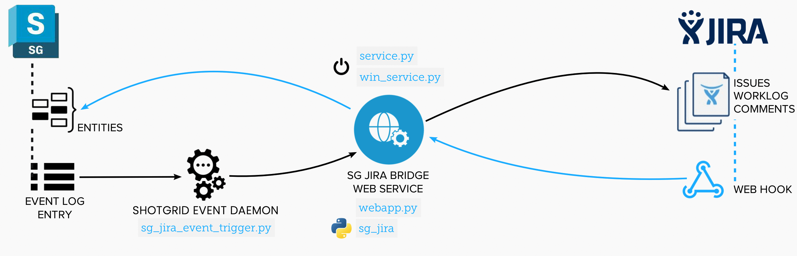

Overview
########
The Shotgun Jira Bridge (``sg-jira-bridge``) provides a simple setup to sync
data between Shotgun and Jira.

At the heart of the workflow is a  lightweight webapp that handles POST
requests to sync data. A request is validated and executed by this module
code which handles all of the connections, logic, and data translation
between Shotgun and Jira. It then sends a request to update Shotgun or
Jira with the translated data.

Requests to sync data from Shotgun to Jira are generated by the
``sg_jira_event_trigger.py`` plugin running in the Shotgun Event Daemon.
Requests to sync data from Jira to Shotgun are generated by a web hook that
is configured  in Jira for your Project.

.. toctree::
    :maxdepth: 2

    self
    quickstart
    settings
    debugging
    developer
    services
    known_issues
